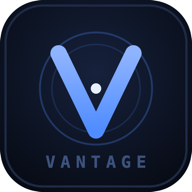
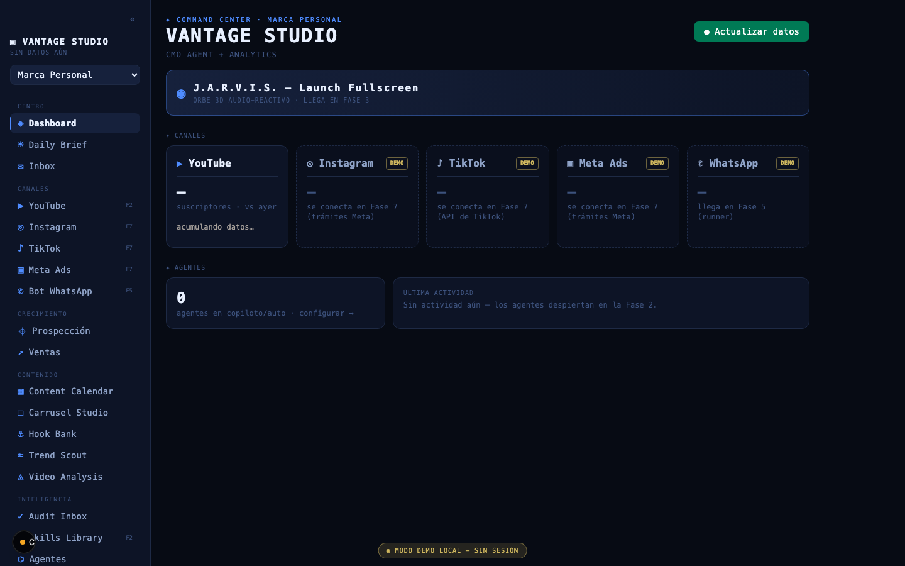
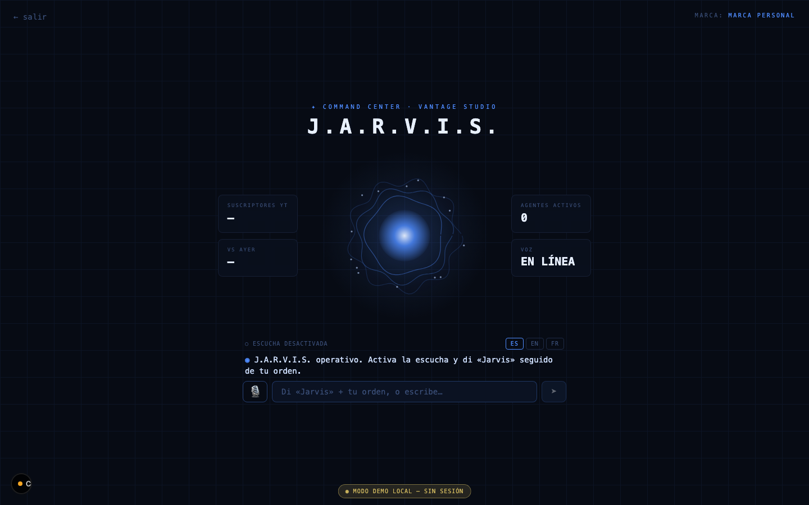
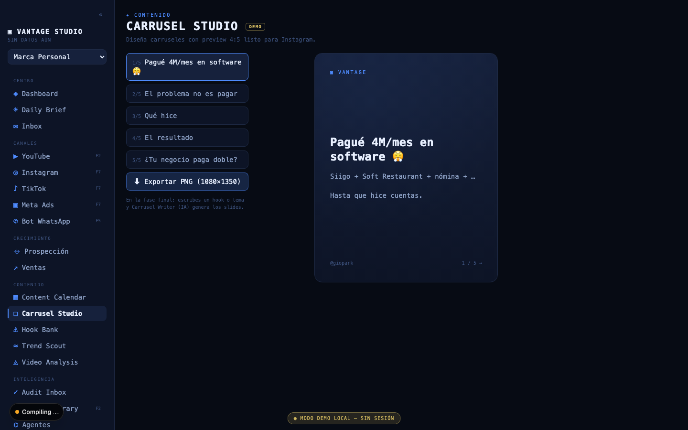

<div align="center">



# Vantage Studio

**Command center de marketing multi-marca con agentes IA.**

Métricas de todos los canales · fábrica de contenido · prospección y ventas · un CMO Agent con autonomía graduable · y un HUD estilo J.A.R.V.I.S. al que le hablas y te responde con voz.



</div>

---

## ¿Qué es?

Una sola app para operar el marketing de **5 marcas** (workspaces): marca personal, dos SaaS, un bar y clientes. Cambias de marca arriba a la izquierda y todo el command center cambia de contexto.

| Grupo | Módulos |
|---|---|
| **Centro** | Dashboard · Daily Brief · Inbox unificado |
| **Canales** | YouTube · Instagram · TikTok · Meta Ads · Bot WhatsApp |
| **Crecimiento** | Prospección · Ventas (pipeline kanban) |
| **Contenido** | Content Calendar · Carrusel Studio (export PNG) · Hook Bank · Trend Scout · Video Analysis |
| **Inteligencia** | Audit Inbox · Skills Library · Agentes · **Jarvis HUD** |

## J.A.R.V.I.S.



HUD fullscreen con orbe animado (cero dependencias). **Escucha continua** con palabra de activación — dices *"Jarvis, dame el brief de hoy"* y responde **con voz**, en **español, inglés o francés** (Web Speech API del navegador, sin servicios de pago). El orbe vibra con el audio real de tu micrófono.

> 🔭 **En rediseño:** el orbe está evolucionando a una **constelación líquida 3D** (partículas con colas de cometa + plexus, WebGL). Prototipo y notas en [`docs/jarvis-orb/`](docs/jarvis-orb/).

## Carrusel Studio



Editor de carruseles con preview 4:5 y **export a PNG 1080×1350** listo para Instagram, renderizado en canvas.

## Stack

- **Next.js 16** (App Router) + React 19 + Tailwind v4 — desplegado en **Vercel**
- **Supabase** — Postgres + RLS + auth (multi-marca: `brands`, `snapshots`, `agent_settings`, `agent_runs`)
- **PWA** instalable (manifest + iconos) · responsive móvil con drawer
- **Vitest** — suite de tests sobre toda la lógica pura
- Capa IA (próxima fase): **API de Claude** (`claude-opus-4-8`) para el CMO Agent

## Correr en local

```bash
cd web
npm install
npm run dev
```

Con `DEMO_MODE=1` en `web/.env.local` la app corre **sin login y con datos demo** (solo funciona en desarrollo; producción siempre exige sesión). Abre http://localhost:3000 y recorre todo — incluido `/jarvis`.

```bash
npm test        # suite de vitest
npm run lint    # eslint
npm run build   # build de producción
```

## Estado del proyecto

| Fase | Estado |
|---|---|
| 1 · Metamorfosis (rebrand, multi-marca, panel de agentes) | ✅ en producción |
| Diseño 1 · Jarvis HUD + UIs de contenido | ✅ en producción |
| Diseño 2 · Centro, crecimiento e inteligencia | ✅ en producción |
| Diseño 3 · Voz de Jarvis, export PNG, pulido | ✅ en producción |
| Diseño 4 · Modo demo, móvil, PWA | ✅ en producción |
| APIs · CMO Agent (Claude), YouTube, conexiones externas | 🔜 plan escrito, esperando llaves |

Los módulos marcados **DEMO** muestran datos de ejemplo hasta que su API se conecte. El diseño completo, las decisiones y los planes de cada fase viven en [`docs/superpowers/`](docs/superpowers/).

## Estructura

```
web/                  # la app Next.js
  src/app/            # rutas (un módulo = una ruta)
  src/components/     # UI compartida (orbe, sidebar, editores…)
  src/lib/            # lógica pura testeada (métricas, alertas, wake word…)
  supabase/migrations # esquema versionado
docs/superpowers/     # specs y planes de implementación por fase
```

---

<div align="center">
<sub>Proyecto personal de Gio · construido con <a href="https://claude.com/claude-code">Claude Code</a></sub>
</div>
