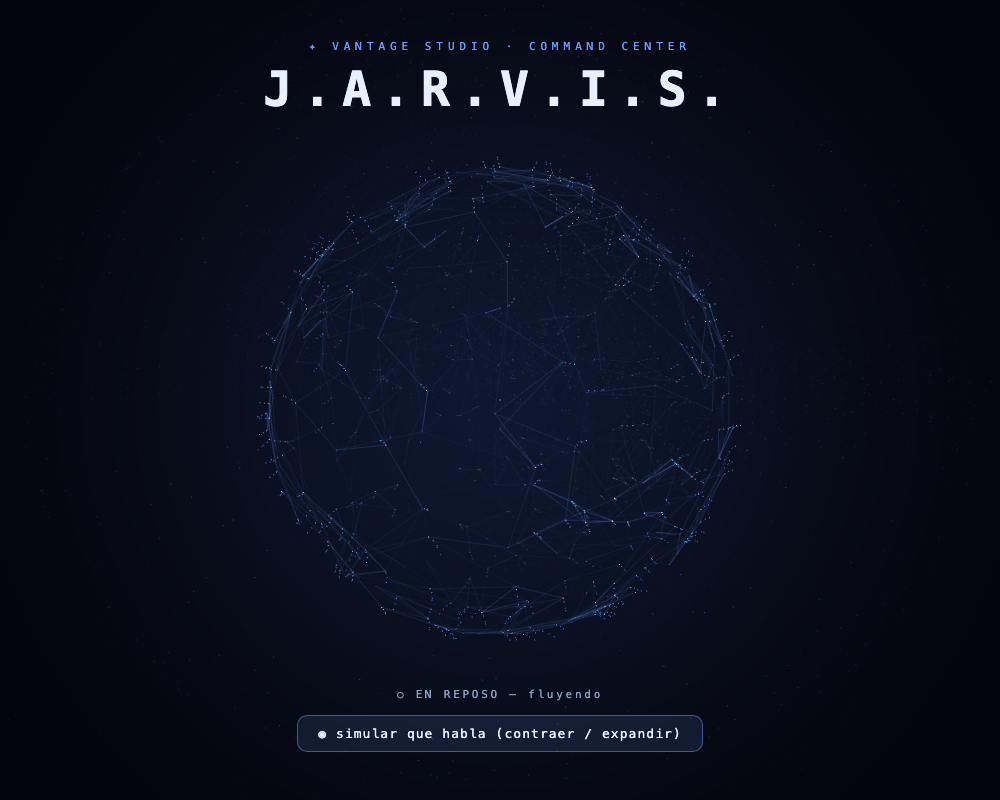

# Jarvis HUD — rediseño del orbe (prototipo)

Rediseño en curso del orbe del `/jarvis`, para que se sienta cinematográfico en vez de plano.

## Concepto

Una **constelación líquida en 3D**: cientos de partículas que fluyen sobre una esfera con *curl noise* (campo de fluido real), cada una arrastrando una **cola de cometa** hecha de puntos circulares que se afinan hacia el final. Entre los puntos cercanos se tejen líneas (**plexus**) que aparecen y desaparecen, formando una red viva. El orbe **respira** (se contrae y expande) y al hablar/escuchar se **expande y se agita**.

Inspirado en una referencia que mandó Gio (orbe de partículas estilo "AI brain network").

## Decisiones técnicas

- **WebGL directo** (no Three.js). Razón: el orbe se verifica por captura de pantalla durante el desarrollo, y el render por software no dibuja los point-sprites de Three.js; WebGL crudo sí es verificable. Es 3D real (proyección en perspectiva con profundidad).
- **Colas de cometa = cadenas de puntos circulares** (no quads/ribbons). Los ribbons se voltean cuando una partícula casi se detiene y producen "cuadrados parpadeando"; con puntos circulares ese glitch es imposible.
- **Movimiento líquido** por advección con *curl noise* (divergence-free) + paso de tiempo fijo (evita saltos al variar el framerate).
- Cero dependencias.

## Estado

Prototipo standalone (`orb-prototype.html`) — ábrelo en un navegador. Pendiente: aprobación visual de Gio y luego **integración al `/jarvis` real** reemplazando el orbe canvas 2D actual (`web/src/components/JarvisOrb.tsx`), conectado al nivel de audio del micrófono que ya captura `JarvisStage.tsx`.
